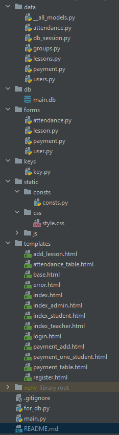

Система для контроля в учреждениях дополнительного образования
==============================================================

ЧТО ЭТО И С ЧЕМ ЕДЯТ
----------------------
Данный проект является системой для контроля учреждений дополнительного образования. С его помощью осуществуется
контроль посещаемости и полаты учеников, также помогает преподователям, ученикам и администрации ориентироваться в
расписании.

ВОЗМОЖНОСТИ
-----------
Приложение позволяет отмечать посещаемость и оплату занятий. Каждый ученик относится к определенной группе, у группы
есть занятия с определенной датой и учителем.  
У каждого ученика, учителя и администратора есть аккаунт. Пользователю отображаются нужные ему данные:

* __Ученик__  
  Ему отображаются его занятия сегодня (на момент пользования сервисом), оплата его занятий и все его расписание на
  неделю.

* __Учитель__
  А он видит сегодняшние занятия и может отмечать посещаемость (только занятий сегодня в соображениях безопасности).

* __~~Всевидящее око~~ Администратор__  
  Может видеть занятия всех групп, отмечать посещаемость и оплату за любой промежуток времени. Также создает занятия и
  регистрирует новых пользователей любого типа.

СТРУКТУРА
---------
Конечно, структуру можно поделить на две части: база данных и файлы.

* Начну с __файлов__. Ничего отличительного от других проектов нет. Разве что приложу картинку со всеми файлами
  

* __База данных__  
  Тут уже интересней. Диаграмму можно посмотреть по [ссылке](readme/DB_Diagram.drawio) (установить расширение для DrawIO
  желательно)

ВРОДЕ ВСЕ РАДУЖНО, НО ГДЕ ПОДВОХ?
-----------------------------
Если вы попробуете воспользоваться продуктом, то вы поймете, что что-то как-то везде не так. Проект, можно сказать, еще
в разработке и сейчас сырой. Перечислю честно, что не успел, что не смог, что сделаю ~~в ближайшее время~~:

* __ДиЗаЙн__  
  Конечно, все сделано в абсолютно стоковом варианте, в белом цвете ~~и даже нет темной темы, позор какой~~
  Причина отсутвия дизайна - я работал один, поэтому не было времени на его проработку

* __А где посещаемость?__  
  Все так, посещаемость не работает, можно только посмотреть, но не отметить. Данная проблема связана с тем, что
  нормальных мануалов как сделать редактируемые таблицы во Фласке нет, а до костылей додумался слишком поздно, убив на
  это уже 2 недели.

* __Я ученик, а ничего не работает__  
  Верно, для ученика еще не написана главная страница и личный кабинет (его можно просто скопировать со странички для
  отметки оплаты и совместить с такой же для посещаемости).

Собственно, на дизайн нужно потратить 10 человеко-часов для меня и поменьше для того, кто знает, что да как, а на
проблему таблиц - максимум 3-4, а на ученика - 1-2 часа с дебагом. Однако, дедлайн уже здесь.

А КАК ПОТЕСТИТЬ?
---------------
Логин/пароль для админа - __admin/admin__

ЗАКЛЮЧЕНИЕ
----------
Проект в разработке и дэмо-релиз можно подготовить уже к концу следующей недели, однако, нас всегда преследует это
страшное слово __дедлайн__

МЫСЛИ ПЕРЕД СНОМ
---------------------

* > Сейчас проект нацелен на компании, которые будут _покупать_ лицензию и сервера.
  > __НО__ можно переориентироваться, позволить учителям отмечать оплату, убрать администраторов
  > и дать преподавателям полный контроль над занятиями, сделать свободную регистрация,
  > тем самым нацелиться на конечного пользователя и сделать подобие GoogleClassroom или вообще площадку для репетиторства. 